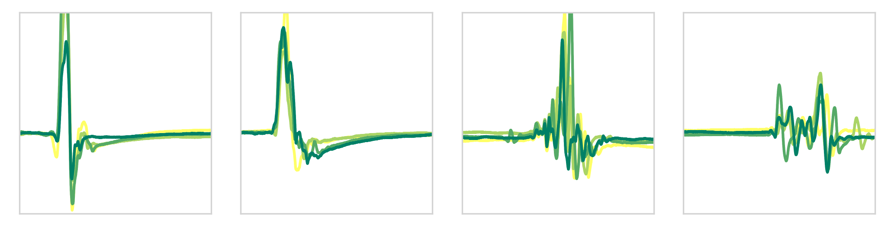

# Deciphering the morphology of motor evoked potentials
## Description
This repo contains the code required to reproduce the results outlined in the paper **Deciphering the morphology of motor evoked potentials**.

## How to use
### Installation
Clone this repository
```bash
git clone https://github.com/JanYperman/morphology.git
```
Install [Anaconda](https://www.anaconda.com/distribution/) (or miniconda) and create a new environment called _morphology_ and activate it.
```bash
conda create --name morphology python=3 pandas scikit-learn pyyaml scipy matplotlib
conda activate morphology
```
### Running the pipeline
To reproduce our results, run:
```python
python frontiers_code.py
```
This will run the complete pipeline using the settings as they were in outlined in the manuscript. All the tables and figures which are based on the small dataset (which holds no sensitive data) will be generated and written to _table\_#.txt_ and _fig#\_description.pdf_ files. Note that the tables are in latex-format. 

The settings for the pipeline can be changed, either by changing them directly in [config.yaml](../master/config.yaml), or by passing them as command line arguments. A few examples:
```bash
# List all possible commandline arguments
python frontiers_code.py --help
# Run the pipeline using the feature with id 400
python frontiers_code.py -chosen_feature 400
# Run the pipeline, skipping the cross-validation step
python frontiers_code.py --skip_first_phase
```
## Dataset
The dataset [dataset.zip](../master/dataset.zip) contains the data required to reproduce the main results. The main file, __dataset.csv__ contains the following fields:
* __name:__ Identifier for the neurologist who annotated the time series
* __visitid:__ Unique identifier for the visit
* __anatomy\_side:__ String indicating the anatomy (AH or APB) and the side on which the measurement was performed (L or R)
* __morph:__ The label assigned by the neurologist (1=normal, 2=abnormal, 3=bad data)
* __clinic\_id__: Unique identifier for a patient, which is used to ensure no patients end up in both the train and the test set.
* __timeseries\_id:__ An identifier to link to the timeseries associated with this entry. E.g. if this is 123 then the timeseries may be found in _timeseries/123.txt_. The corresponding features would then be found in _features/123.txt_.

The two folders _timeseries_ and _features_ contain the individual timeseries and features respectively. They may be coupled to the entries in __dataset.csv__ by means of the _timeseries\_id_ field. Note that this is done automatically when running [frontiers_code.py](../master/frontiers_code.py), which stores a pickled dataframe called _frontiers\_dataset.p_ in the root.

### Calculate approximate entropy
To calculate the approximate entropy for new timeseries, use the function `normalized_approximate_entropy` defined in `calculate_apen.py`. It will assume 1920 samples per timeseries.This function also applies the normalization with the same parameters as those used in the paper. The function is illustrated by recalculating the approximate entropy of the timeseries in the dataset.
